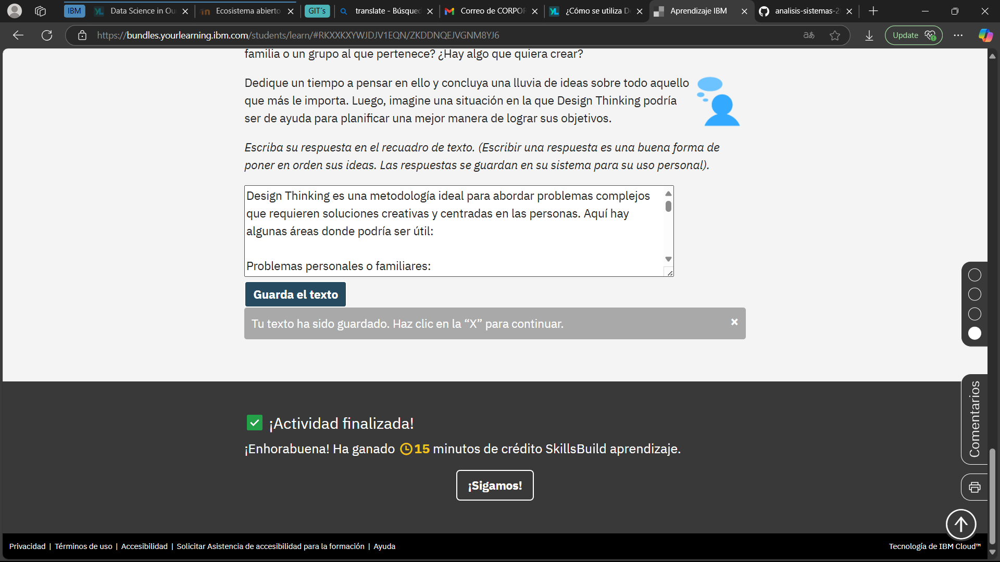

# Cómo se aplica Design Thinking
Design Thinking es una metodología ideal para abordar **problemas complejos** que requieren soluciones creativas y centradas en las personas. Aquí hay algunas áreas donde podría ser útil:

1. **Problemas personales o familiares**:  
   - Por ejemplo, mejorar la comunicación familiar o encontrar maneras de equilibrar el trabajo y la vida personal.  

2. **Proyectos comunitarios**:  
   - Diseñar iniciativas para reducir el desperdicio de alimentos en tu vecindario o crear programas de apoyo para personas mayores.  

3. **Innovación en educación**:  
   - Desarrollar herramientas o métodos para hacer el aprendizaje más accesible y efectivo, especialmente en comunidades con recursos limitados.  

4. **Salud y bienestar**:  
   - Crear soluciones para mejorar el acceso a servicios de salud mental o promover hábitos saludables en tu comunidad.  

5. **Sostenibilidad ambiental**:  
   - Diseñar proyectos para reducir el uso de plásticos o fomentar el reciclaje en tu área.  

---

## Ejemplo de aplicación:
Imagina que quieres **mejorar la calidad de vida de las personas mayores** en tu comunidad. Usando Design Thinking, podrías:  
1. **Empatizar**: Hablar con personas mayores para entender sus necesidades y desafíos.  
2. **Definir**: Identificar problemas específicos, como la soledad o la movilidad reducida.  
3. **Idear**: Generar ideas, como crear un programa de acompañamiento o diseñar una app para conectar a personas mayores con voluntarios.  
4. **Prototipar**: Probar una solución pequeña, como un grupo de apoyo semanal.  
5. **Testear**: Evaluar su efectividad y hacer ajustes.  

Design Thinking es una herramienta poderosa para **transformar ideas en soluciones concretas** que realmente impacten en la vida de las personas.

***
