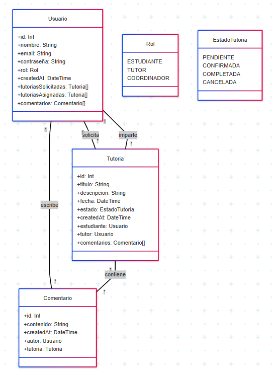
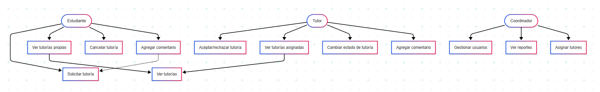
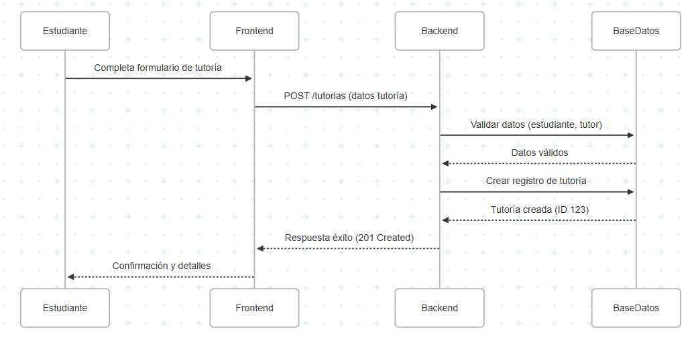
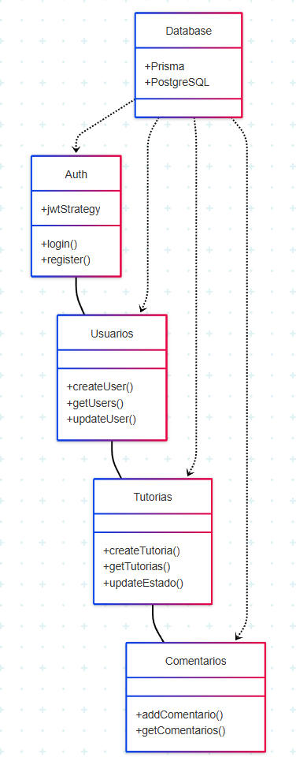

# Diagramas UML para Totoría Plus
## Diagrama de clases

### Explicación:

    *Usuario:* Clase principal que representa a todos los usuarios del sistema (estudiantes, tutores y coordinadores).

    *Tutoria:* Representa las sesiones de tutoría programadas entre estudiantes y tutores.

    *Comentario:* Permite la comunicación entre participantes sobre una tutoría específica.

    *Enumeraciones:* Definen los roles posibles y los estados por los que pasa una tutoría.

## Diagrama de casos de uso

### Actores y sus funciones principales:

    *Estudiante:* Solicita tutorías, gestiona sus propias solicitudes y participa en las sesiones.

    *Tutor:* Gestiona las tutorías asignadas, cambia su estado y proporciona retroalimentación.

    *Coordinador:* Supervisa el sistema, genera reportes y gestiona la asignación de tutores.

## Diagrama de Secuencia (Solicitud de Tutoría)

### Flujo:

    1. El estudiante completa el formulario en el frontend.

    2. El frontend envía los datos al backend.

    3. El backend valida la existencia del estudiante y tutor.

    4. Se crea el registro en la base de datos.

    5. Se notifica al estudiante del éxito de la operación.

## Diagrama de Paquetes

### Estructura de módulos:

    *Auth:* Maneja autenticación y autorización.

    *Usuarios:* Gestiona CRUD de usuarios y roles.

    *Tutorias:* Administra el ciclo de vida de las tutorías.

    *Comentarios:* Controla la comunicación asociada a tutorías.

    *Database:* Capa de persistencia compartida por todos los módulos.